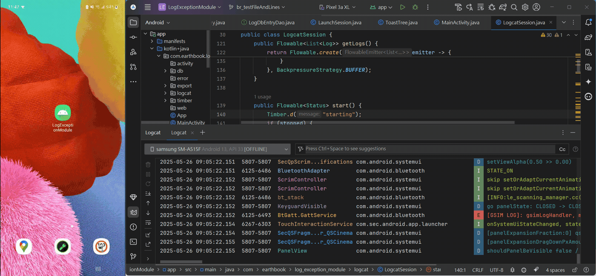

# RxTimber with DbTree

一個強大的 Android 日誌記錄庫，擴展了 Timber 功能，提供資料庫存儲、會話管理和匯出功能。

## 功能特點

- **增強的日誌記錄**：基於 Timber 構建，支持響應式擴展
- **資料庫存儲**：自動將日誌存儲在本地 SQLite 資料庫中
- **會話管理**：將日誌組織成會話，便於追蹤
- **匯出功能**：將日誌匯出為 JSON 文件或匯出整個資料庫
- **日誌過濾**：按級別、會話或關鍵字過濾日誌
- **記憶體效率**：優化以最小化記憶體使用
- **代碼定位**：自動記錄日誌來源的代碼位置，便於快速定位問題

## 設置

### 1. 設置 JitPack 儲存庫

在您的專案級 `settings.gradle`（或根目錄 `build.gradle`）中添加以下內容：

```gradle
dependencyResolutionManagement {
    repositories {
        google()
        mavenCentral()
        maven { url 'https://jitpack.io' }
    }
}
```

### 2. 添加依賴

在應用的 `build.gradle` 文件中添加以下內容：

```gradle
dependencies {
     // 將 'Tag' 替換為最新的發布版本號 (例如 1.0.1)
    implementation 'com.github.FalconJK:LogExceptionModule:1.0.1'
}
```

### 2. 在 Application 類中初始化

```java
public class MyApplication extends Application {
    @Override
    public void onCreate() {
        super.onCreate();
        
        // 植入日誌樹
        Timber.plant(new Timber.DbTree(this));  // 資料庫日誌記錄
        Timber.plant(new Timber.DebugTree());   // 控制台日誌記錄（可選）
    }
}
```

## 基本使用

### 記錄訊息

Timber 提供了多種日誌記錄方法，對應不同的日誌級別：

```java
// VERBOSE 級別日誌
Timber.v("詳細日誌訊息");
Timber.v("格式化詳細訊息：使用者 %s 登入時間 %d", "張三", System.currentTimeMillis());
Timber.v(throwable);  // 只記錄異常
Timber.v(throwable, "發生異常：%s", throwable.getMessage());  // 記錄異常和訊息

// DEBUG 級別日誌
Timber.d("調試訊息");
Timber.d("格式化調試訊息：計數=%d，狀態=%b", 42, true);
Timber.d(throwable);
Timber.d(throwable, "調試異常：%s", throwable.getMessage());

// INFO 級別日誌
Timber.i("信息訊息");
Timber.i("格式化信息：應用版本 %s，API 等級 %d", BuildConfig.VERSION_NAME, Build.VERSION.SDK_INT);
Timber.i(throwable);
Timber.i(throwable, "信息異常：%s", throwable.getMessage());

// WARN 級別日誌
Timber.w("警告訊息");
Timber.w("格式化警告：記憶體使用率 %.2f%%", 75.6f);
Timber.w(throwable);
Timber.w(throwable, "警告異常：%s", throwable.getMessage());

// ERROR 級別日誌
Timber.e("錯誤訊息");
Timber.e("格式化錯誤：操作 '%s' 失敗，錯誤碼 %d", "檔案上傳", 404);
Timber.e(throwable);
Timber.e(throwable, "錯誤異常：%s", throwable.getMessage());

// ASSERT 級別日誌 (WTF = What a Terrible Failure)
Timber.wtf("嚴重錯誤訊息");
Timber.wtf("格式化嚴重錯誤：系統崩潰於 %tc", Calendar.getInstance());
Timber.wtf(throwable);
Timber.wtf(throwable, "嚴重錯誤：%s", throwable.getMessage());

// 使用自定義優先級
Timber.log(Log.DEBUG, "自定義優先級訊息");
Timber.log(Log.DEBUG, "格式化自定義訊息：%d - %s", 100, "測試");
Timber.log(Log.ERROR, throwable);
Timber.log(Log.INFO, throwable, "自定義優先級異常：%s", throwable.getMessage());
```

### 使用標籤

```java
// 為單條日誌設置標籤
Timber.tag("自定義標籤").d("帶標籤的調試訊息");

// 標籤只會應用於這一條日誌
Timber.tag("標籤1").d("這條日誌使用標籤1");
Timber.d("這條日誌不使用標籤1");
```

### 代碼定位功能

本庫自動為每條日誌添加代碼位置信息，格式為 `(檔名:行號)`，例如：

```java
Timber.d("測試訊息");
// 輸出: (MainActivity.java:42) 測試訊息
```

這使您可以快速定位到日誌的確切來源，尤其在調試複雜問題時非常有用。

### 查看日誌

要打開會話列表活動：

```java
Timber.startSessionActivity(context);
```

這將顯示所有日誌會話的列表。從這裡，您可以：
- 查看每個會話的日誌
- 將日誌分享為 JSON 文件
- 刪除會話
- 匯出整個資料庫


## 進階功能

### 匯出資料庫

```java
LogDatabase.getInstance(context)
    .exportDatabase(context)
    .subscribeOn(Schedulers.io())
    .observeOn(AndroidSchedulers.mainThread())
    .subscribe(
        filePath -> {
            // 資料庫成功匯出到 filePath
        },
        throwable -> {
            // 處理錯誤
        }
    );
```

### 清理舊日誌

```java
// 刪除 7 天前的日誌
long sevenDaysAgo = System.currentTimeMillis() - (7 * 24 * 60 * 60 * 1000);
LogDatabase.getInstance(context)
    .logEntryDao()
    .deleteOldLogs(sevenDaysAgo)
    .subscribeOn(Schedulers.io())
    .subscribe();
```

### 搜索日誌

```java
LogDatabase.getInstance(context)
    .logEntryDao()
    .searchLogsByKeyword("error", sessionId)
    .subscribeOn(Schedulers.io())
    .observeOn(AndroidSchedulers.mainThread())
    .subscribe(logs -> {
        // 處理過濾後的日誌
    });
```

## 自定義 Tree

您可以創建自己的 Tree 來自定義日誌處理邏輯：
1. [ToastTree](app/src/main/java/com/earthbook/log_exception_module/ToastTree.java)
2. [EbDebugTree: tag 添加"myEb"做開頭](app/src/main/java/com/earthbook/log_exception_module/EbDebugTree.java)

```java
public class MyCustomTree extends Tree {
    @Override
    protected void log(int priority, @Nullable String tag, String link, 
                      @NotNull String message, @Nullable Throwable t, 
                      StackTraceElement[] stackTraces) {
        // 自定義日誌處理邏輯
        String formattedMessage = String.format("(%s) %s", link, message);
        
        // 可以根據優先級過濾
        if (priority >= Log.WARN) {
            // 處理警告及以上級別的日誌
        }
        
        // 可以添加自定義格式
        String customFormat = String.format("[%s] %s: %s", 
                                          getLogLevelString(priority), 
                                          tag, 
                                          formattedMessage);
        
        // 可以將日誌發送到自定義目的地
        // 例如：網絡服務、自定義文件等、Toast
    }
    
    private String getLogLevelString(int priority) {
        switch (priority) {
            case Log.VERBOSE: return "VERBOSE";
            case Log.DEBUG: return "DEBUG";
            case Log.INFO: return "INFO";
            case Log.WARN: return "WARN";
            case Log.ERROR: return "ERROR";
            case Log.ASSERT: return "ASSERT";
            default: return "UNKNOWN";
        }
    }
    
    // 可選：自定義調度器
    @Override
    protected Scheduler getScheduler() {
        // 返回自定義調度器，例如計算調度器
        return AndroidSchedulers.mainThread();
    }
}

// 使用自定義 Tree
Timber.plant(new MyCustomTree());
```

## 最佳實踐

1. **清理訂閱**：始終處理您的訂閱以防止記憶體洩漏
   ```java
   @Override
   protected void onDestroy() {
       disposables.clear();
       super.onDestroy();
   }
   ```

2. **有效使用標籤**：標籤有助於組織和過濾日誌
   ```java
   Timber.tag("網絡模組").d("API 請求已開始");
   ```

3. **在錯誤日誌中包含上下文**：添加相關信息以幫助調試
   ```java
   Timber.e("加載用戶數據失敗。用戶 ID：%s，狀態碼：%d", userId, statusCode);
   ```

4. **定期匯出日誌**：對於關鍵應用程序，考慮自動日誌匯出

5. **利用代碼定位功能**：通過日誌中的位置信息快速定位問題源頭

## 特殊功能

### 大型會話處理

當會話包含大量日誌時，系統會提供多種處理選項：
- **僅匯出錯誤日誌**：只匯出 ERROR 級別的日誌
- **清理後匯出**：刪除超長訊息後再匯出
- **強制匯出**：直接匯出完整會話（可能較大）

### 日誌大小估算

`LogDbEntry` 類提供了 `getBytes()` 方法來估算日誌條目的大小，有助於管理記憶體使用：

```java
LogDbEntry entry = new LogDbEntry(/* 參數 */);
long sizeInBytes = entry.getBytes();
```

### 自動刷新機制

日誌系統具有智能緩衝機制，會在以下情況自動將日誌寫入資料庫：
- 達到緩衝區大小限制（預設 1000 條）
- 達到時間閾值（預設 30 秒）
- 緩衝區大小超過記憶體限制（預設 20MB）
- 應用進入後台或活動暫停/停止

## 許可證

```
MIT License

Copyright (c) 2025 FalconJK

Permission is hereby granted, free of charge, to any person obtaining a copy
of this software and associated documentation files (the "Software"), to deal
in the Software without restriction, including without limitation the rights
to use, copy, modify, merge, publish, distribute, sublicense, and/or sell
copies of the Software, and to permit persons to whom the Software is
furnished to do so, subject to the following conditions:

The above copyright notice and this permission notice shall be included in all
copies or substantial portions of the Software.

THE SOFTWARE IS PROVIDED "AS IS", WITHOUT WARRANTY OF ANY KIND, EXPRESS OR
IMPLIED, INCLUDING BUT NOT LIMITED TO THE WARRANTIES OF MERCHANTABILITY,
FITNESS FOR A PARTICULAR PURPOSE AND NONINFRINGEMENT. IN NO EVENT SHALL THE
AUTHORS OR COPYRIGHT HOLDERS BE LIABLE FOR ANY CLAIM, DAMAGES OR OTHER
LIABILITY, WHETHER IN AN ACTION OF CONTRACT, TORT OR OTHERWISE, ARISING FROM,
OUT OF OR IN CONNECTION WITH THE SOFTWARE OR THE USE OR OTHER DEALINGS IN THE
SOFTWARE.
```